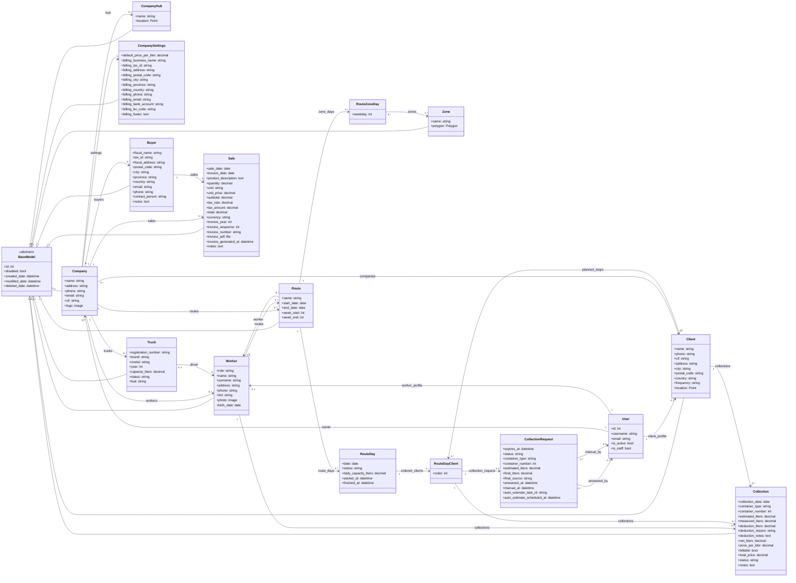
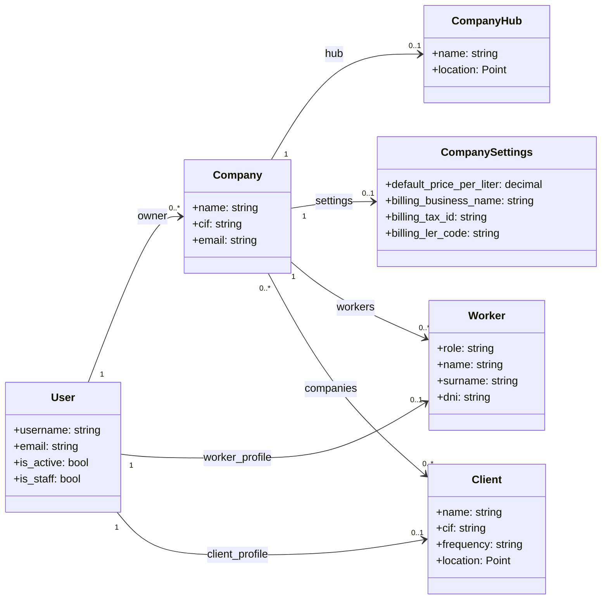
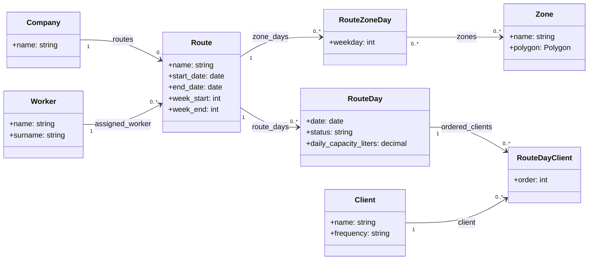
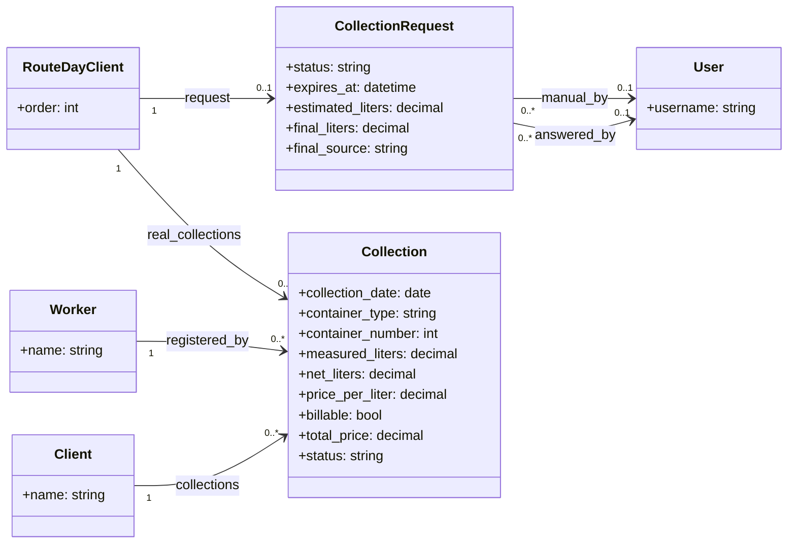
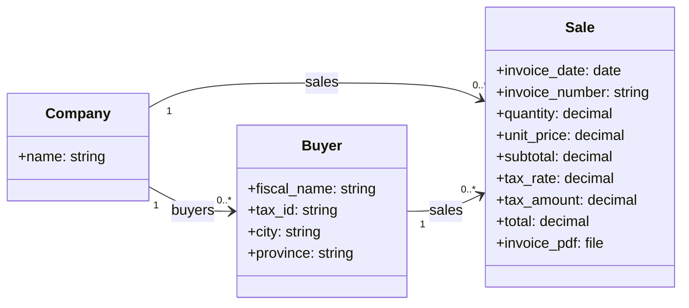

# UML de Base de Datos

Fecha de revision: 2026-04-08

## 1. Objetivo

Este documento describe el modelo de datos principal de GreenPath a partir de los modelos Django actualmente vigentes en el proyecto.

Su finalidad es servir como apoyo para:

- comprender la estructura persistente del sistema
- revisar relaciones y cardinalidades antes de modificar backend
- justificar el modelado de datos en la memoria del TFG
- explicar como se conectan los modulos de operacion, recogidas y ventas

## 2. Alcance

El UML cubre las entidades funcionales principales del sistema:

- usuarios y perfiles
- empresa y configuracion global
- clientes, trabajadores y camiones
- zonas y rutas
- solicitudes previas y recogidas reales
- compradores, ventas y facturas

No se incluyen:

- tablas internas de Django (`auth_*`, `django_*`, `authtoken_*`, etc.)
- tablas de Celery
- tablas de historico generadas por `simple_history`
- tablas `ManyToMany` auto-generadas con detalle fisico completo, salvo cuando interesa a nivel conceptual

## 3. Criterios de lectura

Para interpretar el documento conviene tener en cuenta lo siguiente:

- `BaseModel` es una clase abstracta, no una tabla propia de negocio
- algunas propiedades del codigo no son columnas reales y se documentan aparte
- el UML representa relaciones funcionales y persistentes, no toda la logica derivada de servicios o serializers
- cuando una relacion es `OneToOne`, en base de datos implica una clave foranea unica

## 4. Resumen estructural del modelo

La base de datos puede entenderse en seis bloques:

1. autenticacion y perfiles
2. empresa y configuracion
3. operacion de rutas
4. solicitudes y recogidas
5. geografia operativa
6. bloque economico y comercial

## 5. Diagrama UML global

## 6. Diagramas por dominio

El diagrama global es util para vision de conjunto, pero en mantenimiento diario suele resultar mas comodo trabajar por subdominios.

### 6.1 Autenticacion, perfiles y empresa

### 6.2 Planificacion de rutas

### 6.3 Solicitudes y recogidas

### 6.4 Bloque comercial y economico

## 7. Inventario de entidades

La siguiente tabla resume cada entidad desde el punto de vista funcional.

| Entidad | Modulo | Funcion principal | Observaciones |
|---|---|---|---|
| `User` | `user` | autenticacion y cuenta base | no almacena el rol final como tabla separada |
| `Worker` | `user` | perfil interno de trabajador u owner | el campo `role` distingue `owner` y `worker` |
| `Client` | `user` | perfil cliente con acceso al portal | tiene geolocalizacion y frecuencia |
| `Company` | `company` | empresa operadora | punto central del modelo |
| `CompanyHub` | `company` | base fisica de salida | geolocalizada |
| `CompanySettings` | `company` | configuracion operativa y fiscal | clave para precio por litro y facturacion |
| `Truck` | `truck` | flota de vehiculos | conductor unico por camion |
| `Zone` | `zone` | zona geografica | poligono PostGIS |
| `Route` | `route` | ruta plantilla | define semana operativa y trabajador |
| `RouteZoneDay` | `route` | asignacion de zonas por dia | usa `ManyToMany` con `Zone` |
| `RouteDay` | `route` | jornada concreta generada | una por ruta y fecha |
| `RouteDayClient` | `route` | parada planificada | ordena clientes por jornada |
| `CollectionRequest` | `collection` | peticion previa de estimacion | una por parada planificada |
| `Collection` | `collection` | recogida real | puede ser planificada o manual |
| `Buyer` | `sale` | comprador interno | sin acceso a plataforma |
| `Sale` | `sale` | venta con factura | incluye PDF y datos economicos |

## 8. Relaciones clave explicadas

### 8.1 Usuarios y perfiles

- `User` es la entidad de autenticacion.
- Un `User` puede tener:
  - un `Worker` asociado
  - o un `Client` asociado
- El sistema deduce el rol funcional a partir de:
  - existencia de `worker_profile`
  - valor de `Worker.role`
  - existencia de `client_profile`

### 8.2 Empresa como centro del dominio

`Company` es la entidad nuclear del sistema. De ella dependen:

- trabajadores
- camiones
- rutas
- compradores
- ventas
- configuracion global
- hub logistico

Esto significa que casi todos los modulos se segmentan realmente por empresa, incluso aunque en algunos puntos el acceso funcional se haga a traves del rol del usuario.

### 8.3 Clientes

- `Client` se relaciona con `User` mediante `OneToOne`
- `Client` puede pertenecer a varias empresas mediante `ManyToMany`
- esta decision facilita escenarios donde un mismo cliente puede operar con mas de una empresa
- `Client.location` permite:
  - geocodificacion
  - inclusion en zonas
  - planificacion de paradas

### 8.4 Trabajadores y camiones

- `Worker` pertenece a una sola empresa
- `Truck` puede tener un unico conductor asignado mediante `OneToOne`
- este modelado refleja la restriccion operativa actual: un camion no debe aparecer vinculado a varios conductores a la vez

### 8.5 Rutas

- `Route` representa una ruta plantilla
- `RouteZoneDay` define que zonas se trabajan cada dia de la semana
- `RouteDay` representa una jornada concreta generada para una fecha
- `RouteDayClient` representa una parada planificada de esa jornada con orden secuencial

### 8.6 Solicitudes y recogidas

- `CollectionRequest` representa la solicitud previa enviada al cliente
- `Collection` representa la recogida real registrada
- una `Collection` puede estar vinculada a una `RouteDayClient`, pero tambien puede ser manual
- `Collection.billable` determina si la recogida entra en agregados economicos

### 8.7 Bloque comercial

- `Buyer` representa un comprador interno sin acceso a la plataforma
- `Sale` representa una venta con:
  - concepto
  - importes
  - IVA
  - numero de factura
  - PDF generado
- `invoice_number` se gestiona manualmente a nivel funcional, aunque el modelo mantenga campos internos (`invoice_year`, `invoice_sequence`) por compatibilidad y trazabilidad

## 9. Claves foraneas y comportamiento de borrado

Esta seccion es importante porque algunas relaciones expresan reglas de negocio a traves de `on_delete`.

| Relacion | Tipo | `on_delete` | Lectura funcional |
|---|---|---|---|
| `Worker.user -> User` | OneToOne | `CASCADE` | si desaparece la cuenta, desaparece el perfil |
| `Client.user -> User` | OneToOne | `CASCADE` | mismo criterio para cliente |
| `Worker.company -> Company` | FK | `SET_NULL` | el trabajador puede quedar sin empresa asignada |
| `Company.owner -> User` | FK | `SET_NULL` | la empresa no desaparece si se borra el owner |
| `Truck.driver -> Worker` | OneToOne | `SET_NULL` | el camion puede quedar sin conductor |
| `Route.company -> Company` | FK | `CASCADE` | la ruta depende de la empresa |
| `Route.worker -> Worker` | FK | `SET_NULL` | una ruta puede quedar sin trabajador |
| `RouteDay.route -> Route` | FK | `CASCADE` | la jornada depende de la ruta |
| `RouteDayClient.route_day -> RouteDay` | FK | `CASCADE` | la parada depende de la jornada |
| `Collection.client -> Client` | FK | `CASCADE` | la recogida depende del cliente |
| `Collection.route_day_client -> RouteDayClient` | FK | `SET_NULL` | la recogida puede sobrevivir como historico manual |
| `Collection.worker -> Worker` | FK | `SET_NULL` | puede mantenerse sin trabajador actual |
| `CollectionRequest.route_day_client -> RouteDayClient` | OneToOne | `CASCADE` | la solicitud depende de la parada |
| `Sale.company -> Company` | FK | `CASCADE` | la venta pertenece a una empresa concreta |
| `Sale.buyer -> Buyer` | FK | `PROTECT` | no debe eliminarse un comprador con ventas asociadas |

## 10. Restricciones funcionales importantes

Las restricciones son una parte esencial del modelo porque encapsulan reglas de negocio.

### 10.1 Restricciones de unicidad

- `User.username` es unico
- `User.email` es unico
- `Truck.registration_number` es unica
- `Zone.name` es unico
- `Route.name` es unico
- `CompanyHub.company` es unico
- `CompanySettings.company` es unico
- `RouteDay` es unico por `(route, date)`
- `RouteDayClient` es unico por:
  - `(route_day, order)`
  - `(route_day, client)`
- `RouteZoneDay` es unico por `(route, weekday)`
- `Buyer` es unico por `(company, tax_id)`
- `Sale` es unica por:
  - `(company, invoice_year, invoice_sequence)`
  - `(company, invoice_number)`

### 10.2 Restricciones de consistencia operativa

- `CollectionRequest` es `OneToOne` con `RouteDayClient`
  - una parada planificada solo puede tener una solicitud activa asociada
- `Collection` tiene una restriccion para impedir varias recogidas activas sobre la misma parada planificada
  - se permite historico cancelado
  - se impide duplicidad funcional de recogidas vivas
- `Buyer` debe pertenecer a la misma empresa que la `Sale` que lo referencia
- `Sale` recalcula subtotal, impuesto y total en backend antes de consolidarse

## 11. Campos geoespaciales

GreenPath utiliza PostGIS, por lo que el modelo incorpora geometria real:

- `Client.location`: `PointField`
- `CompanyHub.location`: `PointField`
- `Zone.polygon`: `PolygonField`

Esto es clave para:

- asignacion de clientes a zonas
- geocodificacion de direcciones
- generacion de rutas
- optimizacion operativa
- representacion cartografica en frontend

## 12. Tablas intermedias relevantes

En la base de datos relacional existen al menos dos relaciones `ManyToMany` que Django materializa con tablas intermedias auto-generadas:

- relacion entre `Client` y `Company`
- relacion entre `RouteZoneDay` y `Zone`

Estas tablas no aparecen como modelos Python explicitos, pero forman parte de la estructura fisica real de la base de datos.

## 13. Campos derivados y propiedades no persistentes

No todo lo que usa el sistema son columnas fisicas. Conviene distinguir las propiedades derivadas:

### `User`

- `role_type`
  - no es una columna
  - se calcula en tiempo de ejecucion a partir del perfil asociado

### `RouteDay`

- `weekday`
- `display_name`

### `Collection`

- `is_manual`
- `route`

### `Buyer`

- `full_fiscal_address`

Estas propiedades son relevantes a nivel funcional, pero no deben confundirse con el modelo persistente real.

## 14. Relacion entre el modelo y el negocio

El modelo de datos esta claramente orientado a tres grandes circuitos funcionales:

### 14.1 Circuito operativo

`Company -> Route -> RouteDay -> RouteDayClient -> CollectionRequest / Collection`

Este circuito cubre:

- planificacion
- contacto previo con el cliente
- ejecucion diaria
- recogida real
- cierre operativo

### 14.2 Circuito geoespacial

`CompanyHub + Zone + Client.location`

Este circuito cubre:

- configuracion territorial
- seleccion de clientes por zona
- calculo de trayectos
- optimizacion de paradas

### 14.3 Circuito economico

`CompanySettings + Collection + Buyer + Sale`

Este circuito cubre:

- precio por litro
- costes de recogidas
- ingresos por ventas
- facturacion PDF
- estadisticas economicas

## 15. Limitaciones y decisiones de modelado

El UML refleja algunas decisiones importantes del proyecto:

- el rol no se modela como tabla separada, sino como logica sobre perfiles
- la empresa es el eje del sistema y segmenta casi todos los modulos
- cada ruta plantilla tiene un unico trabajador asignado en el modelo actual
- las rutas no almacenan litros previstos por cliente, eso se resuelve en planificacion y solicitudes
- las recogidas mantienen independencia historica aunque la parada planificada pueda desaparecer
- la venta y la factura se agrupan en una misma entidad (`Sale`), lo que simplifica el flujo actual
- el numero de factura es manual a nivel de negocio, mientras que `invoice_year` e `invoice_sequence` quedan como soporte interno del modelo

## 16. Observaciones de lectura para defensa

Si este UML se utiliza en una memoria o defensa, conviene remarcar:

- que `Company` es el eje del aislamiento multiempresa
- que el circuito operativo y el circuito economico comparten datos, pero no se confunden
- que `Collection.billable` permite separar dato operativo de impacto economico
- que `Sale` concentra tanto la venta como la referencia documental del PDF

## 17. Uso recomendado del documento

Este documento es especialmente util cuando se necesita:

- explicar la estructura del sistema en la memoria del TFG
- justificar el modelado de datos
- revisar relaciones antes de tocar backend
- entender el impacto de una migracion
- explicar a un tercero como se conectan rutas, recogidas y ventas
- preparar diagramas mas resumidos para una defensa oral

## 18. Documentos relacionados

- `docs/ARQUITECTURA_TECNICA.md`
- `docs/FUNCIONAL.md`
- `docs/API.md`
- `docs/ROUTE_FLOW.md`
- `docs/INTEGRACIONES_Y_APIS_EXTERNAS.md`
- `docs/PLANIFICACION_Y_COSTES.md`
- `docs/CASOS_DE_USO.md`
